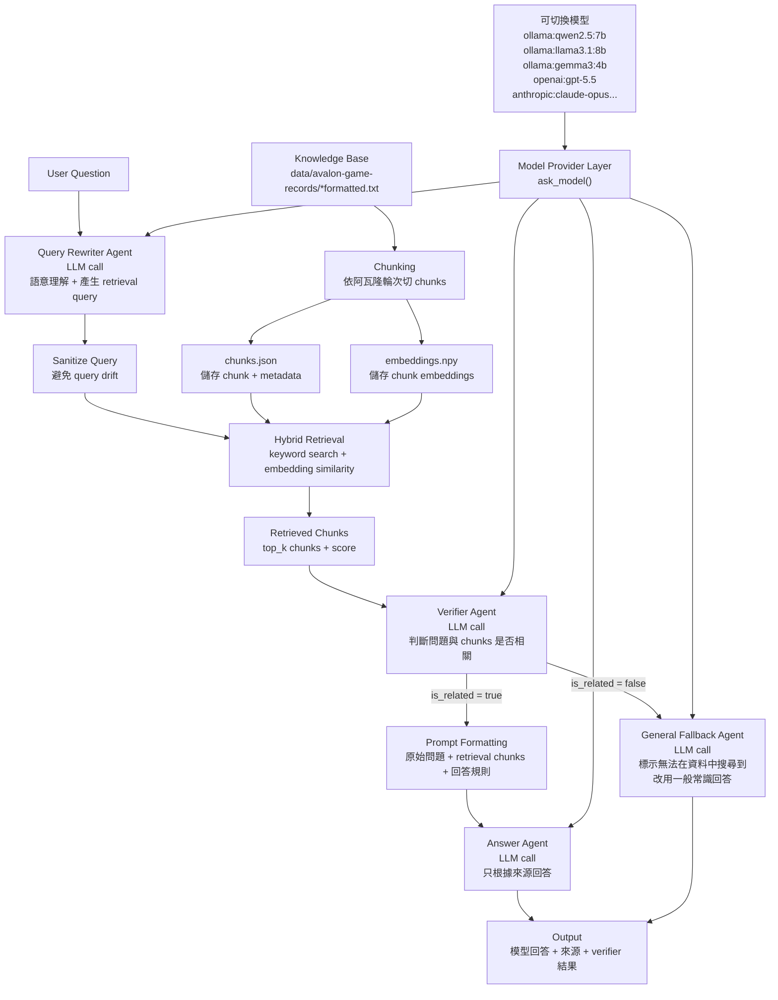

# Current RAG Architecture

更新日期：2026-06-04

## 視覺化架構圖



## 簡化流程

```text
Knowledge Base
→ Chunking
→ Embedding Index
→ User Question
→ Query Rewrite
→ Hybrid Retrieval
→ Verifier
→ Answer / General Fallback
→ Output
```

## 目前架構重點

- 同一套 RAG pipeline 可切換不同 model provider。
- Query Rewriter Agent、Verifier Agent、Answer Agent 與 General Fallback Agent 分別使用獨立 prompt。
- 現階段各 agent 共用同一個 model spec，尚未拆成每個 agent 各自指定模型。
- Retrieval 與 Generation 分離；LLM 最後看到的是 retrieval chunks，不是 embedding。
- 無相關來源時會明確標示「無法在資料中搜尋到」，再改用一般常識回答。
