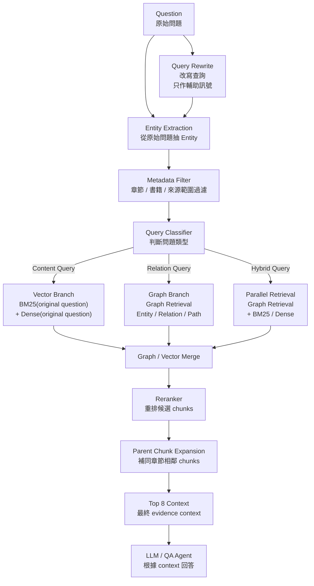

# GraphRAG Incremental Upgrade Roadmap

日期：2026-06-15

本文件紀錄在不重做現有 RAG pipeline 的前提下，逐步加入 Graph Retrieval / GraphRAG 能力的三階段路線。

目前已驗證的 retrieval baseline：

```text
Question
↓
Query Rewrite
↓
Metadata Filter
↓
BM25(original question) + Dense(original question)
↓
RRF Merge
↓
Reranker
↓
Parent Chunk Expansion
↓
Top 8 Context
↓
LLM
```

設計原則：

- 不取代現有 BM25 + Dense retrieval。
- Graph 先補足人物關係、組織關係、多跳查詢與時間線查詢。
- BM25 / Dense 維持使用 original question，避免 query rewrite 造成 recall drift。
- Query Rewrite 可保留為 metadata filtering、reranking 或 graph query expansion 的輔助訊號。
- Graph Retrieval 的輸出要回到 supporting chunks，最後仍提供可引用的原文 context。

## Version 1：最低成本

目標：用最小改動補上人物 / 組織 / 派別查詢能力。

新增元件：

- Entity dictionary
- Simple alias table
- Rule-based Query Classifier
- Simple Graph JSON store
- Graph supporting chunk lookup

建議架構：

```text
Question
↓
Query Rewrite
↓
Metadata Filter
↓
Query Classifier
↓
if Relation Query:
    Simple Graph Lookup
    ↓
    Supporting Chunks
else:
    BM25(original question) + Dense(original question)
↓
Merge
↓
Reranker
↓
Parent Chunk Expansion
↓
Top 8 Context
↓
LLM
```

適合處理：

- 「申玉菲屬於哪一派？」
- 「哪些人屬於 ETO？」
- 「葉文潔和紅岸基地是什麼關係？」

工程量：

```text
2-4 天
```

預期效果：

- Recall：中幅提升，主要改善人物 / 組織 / 派別題。
- Precision：中高提升，因為關係題不再只靠文字相似度。
- Latency：低到中，JSON graph lookup 成本很低。
- 維護成本：低，但需要手動維護 alias / entity dictionary。

風險：

- Graph 規模小時覆蓋率有限。
- 手動 graph 容易漏關係。
- 多跳能力有限。

## Version 2：平衡方案

目標：建立正式 Entity Layer 與 Graph Retrieval branch，支援 hybrid query。

新增元件：

- Offline Entity Extraction
- Entity normalization
- Entity alias resolution
- Graph schema
- Graph retrieval branch
- Graph + Vector merge
- Graph evidence report

建議架構：

```text
Question
↓
Query Rewrite
↓
Entity Extraction
↓
Metadata Filter
↓
Query Classifier
↓
Content Query:
    BM25(original question) + Dense(original question)
Relation Query:
    Graph Retrieval → Supporting Chunks
Hybrid Query:
    Graph Retrieval + BM25/Dense parallel
↓
Graph / Vector Merge
↓
Reranker
↓
Parent Chunk Expansion
↓
Top 8 Context
↓
LLM
```

流程圖：



適合處理：

- 「葉文潔為什麼建立 ETO？」
- 「申玉菲為什麼阻止降臨派？」
- 「智子為什麼要鎖死人類科學？」
- 「某事件涉及哪些人物與組織？」

工程量：

```text
1-2 週
```

預期效果：

- Recall：高提升，尤其對人物、組織、事件、多跳題。
- Precision：高提升，因為 graph relation 可作為 reranking prior。
- Latency：中，hybrid query 會多跑 graph branch。
- 維護成本：中，需要維護 entity extraction、alias resolution 與 graph quality。

推薦 schema：

```text
Nodes:
Person
Organization
Location
Event
Concept
Object
Chapter
Chunk

Relations:
Person -MEMBER_OF→ Organization
Person -LEADS→ Organization
Person -KNOWS→ Person
Person -PARTICIPATED_IN→ Event
Organization -HAS_FACTION→ Organization
Organization -OPERATES_AT→ Location
Event -OCCURRED_AT→ Location
Event -INVOLVES→ Person
Event -USES→ Object
Concept -EXPLAINS→ Event
Chunk -MENTIONS→ Entity
Chunk -SUPPORTS→ Relation
Chapter -CONTAINS→ Chunk
```

風險：

- Relation extraction 品質會直接影響 graph retrieval。
- Graph facts 必須保留 supporting chunk，否則容易變成不可驗證結論。
- Merge / rerank 需要處理 graph context 與 vector context 的不同分數尺度。

## Version 3：最佳效果

目標：升級為完整 GraphRAG，支援多跳、時間線與 graph-aware context assembly。

新增元件：

- Neo4j or graph database
- LLM-assisted relation extraction
- Relation confidence score
- Temporal graph
- Multi-hop path retrieval
- GraphRAG-style community summary
- Cross-encoder reranker
- Graph-aware context assembly

建議架構：

```text
Question
↓
Query Rewrite
↓
Entity Extraction
↓
Query Classification
↓
Metadata Filter
↓
Graph Retrieval / Multi-hop Retrieval
↓
BM25(original question) + Dense(original question)
↓
Graph + Vector Fusion
↓
Cross-Encoder Reranker
↓
Parent Chunk Expansion
↓
Graph-aware Top Context
↓
LLM
```

適合處理：

- 人物關係鏈。
- 組織派別與立場變化。
- 多跳查詢。
- 事件時間線查詢。
- 「某人為什麼做某事」這類關係 + 動機混合題。

工程量：

```text
3-6 週
```

預期效果：

- Recall：最高，尤其是跨章節、多跳、時間線問題。
- Precision：最高，但高度依賴 graph quality 與 reranker。
- Latency：高，需要 graph traversal、vector retrieval、fusion、cross-encoder rerank。
- 維護成本：高，需要 graph schema、ETL、relation validation、資料版本控管。

風險：

- 工程複雜度明顯上升。
- Graph extraction 錯誤會被放大。
- 需要更多 evaluation set，尤其是 relation / multi-hop 題。

## 推薦實作順序

```text
Version 1
→ 驗證人物 / 組織 / 派別查詢是否改善
→ Version 2
→ 建立正式 Entity Layer 與 Graph / Vector Merge
→ Version 3
→ 視 demo 需求導入 Neo4j / GraphRAG
```

目前最適合的下一步：

```text
1. Entity Extraction Layer
2. Simple Graph Store
3. Query Classifier + Graph branch
```

這三項可以保留目前已驗證的 retrieval pipeline，同時補上小說 RAG 最需要的關係型檢索能力。
